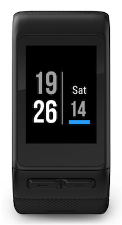

# Simple WatchFace

A simple watch face application for the Garmin Vivoactive HR smart watch.

## Objective

I needed a simple design that clearly displays the time & date which is easily
readable without my reading glasses. I use existing widgets for activity data
so time, date & battery level indicator is sufficient.

### Battery Indicator

A simple battery level indicator uses just colour to signify the battery status,
I only need to know if the status is Good, OK, or Low.

| Status | Battery Level Percentage      | Display Colour |
|:-      |:-                             |:-              |
| Good   | >= 50                         | Blue           |
| OK     | < 50 & >= 15                  | Yellow         |
| Low    | < 15                          | Red            |

## Limitations

Its very simple, the clue is in the name :wink:

Settings have not been fully configured, will add this feature soon....

### Installation

The app has not been submitted to Garmin so is not available from the IQ store.
If you want to use it, download it, download the Garmin IQ SDK, and build it
yourself.

Currently only configured/tested for the following devices...

- Vivoactive HR

In the following languages...

- English (UK)

---
(c) copyright pecodez
